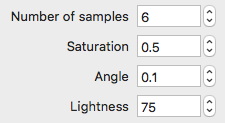

= NumberStepper
MetroWind <chris.corsair@gmail.com>

NumberStepper is a custom control for macOS to input numbers. It’s
basically a wrapper of a label, an `NSTextField` with a formatter, and
an `NSStepper`. The label is optional.

The code is in Swift 4.

== Installation

Just copy the swift file into your project.

== Usage

Just use it normally. Interface builder is fully supported.
